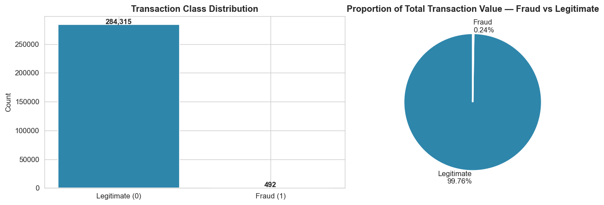
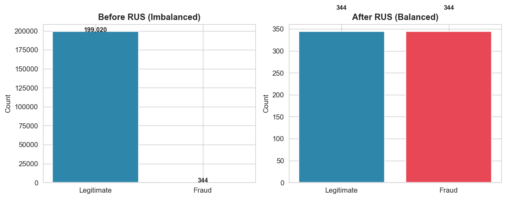
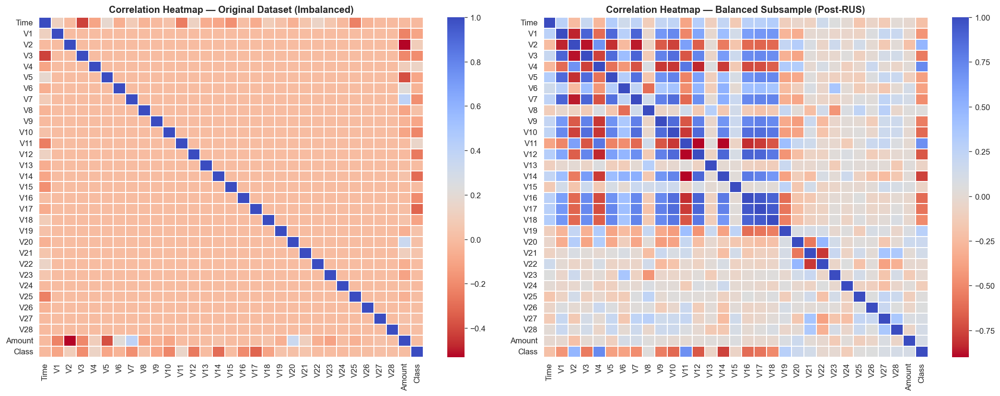
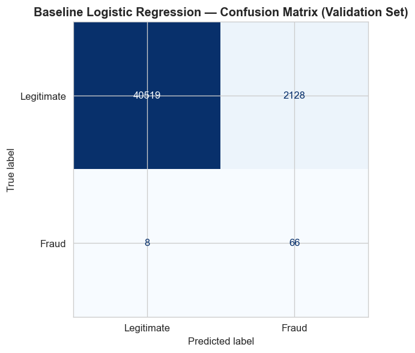
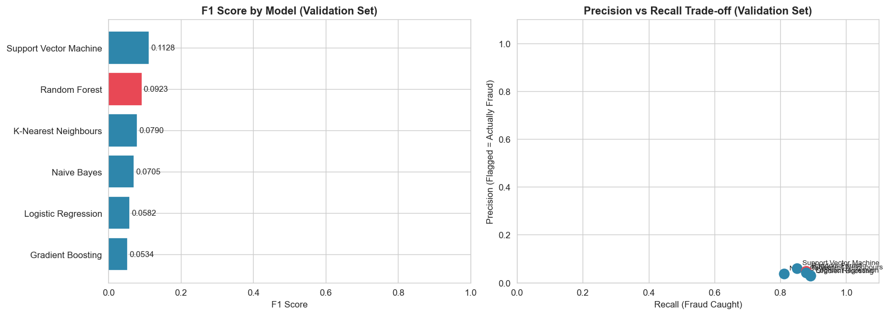
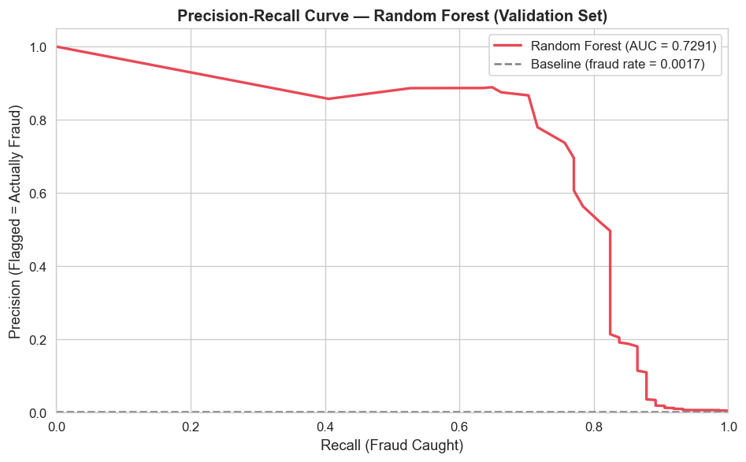

# Credit Card Fraud Detection Pipeline


A collaborative, two-stage machine learning pipeline for detecting fraudulent credit card transactions in a severely imbalanced dataset (0.17% fraud rate). Built to simulate a production data science workflow with separated Data Engineering and Model Development responsibilities.

---

## The Problem

The dataset contains **284,807 transactions** by European cardholders (September 2013), of which only **492 (0.17%) are fraudulent**. This extreme class imbalance means a naive model that predicts "not fraud" for every transaction achieves 99.83% accuracy — making accuracy a meaningless metric. The pipeline is optimised for **F1-score, Precision, and Recall** instead.

---

## Project Structure

```
Fraud-detection/
├── data/
│   └── README.md               ← Dataset download instructions
├── notebooks/
│   ├── data_pipeline.ipynb     ← Stage 1: Data Engineering (Muhammad Patel)
│   └── modelling.ipynb         ← Stage 2: Model Development
├── src/
│   └── fraud_det_api.py        ← FastAPI REST endpoint
├── models/
│   └── fraud_det_model.pkl     ← Serialised production model
├── images/                     ← Visualisations (auto-generated by notebooks)
├── requirements.txt
└── README.md
```

---

## The Collaboration

This project simulated a production workflow by splitting responsibilities across two roles:

| Role | Contributor | Scope |
|---|---|---|
| **Data Engineering Lead** | Muhammad Patel | EDA, preprocessing, imbalance handling, stratified splitting, baseline model |
| **Model Development** | Thando Mothle | Multi-model training, comparison, production model selection, API deployment |

---

## Stage 1 — Data Engineering (`data_pipeline.ipynb`)

### Class Imbalance


The dataset is heavily skewed — 492 fraud cases out of 284,807 transactions. The fraud class also accounts for a disproportionately small share of total transaction value.

### Pipeline Design

**Stratified Train / Validation / Test Split (70/15/15)**

A three-way stratified split ensures the 0.17% fraud rate is preserved across all sets, preventing model bias from uneven fraud distribution. The test set is held out entirely until final evaluation to prevent data leakage.

**Scaling — RobustScaler**

The `Amount` feature contains extreme outliers. `RobustScaler` (median + IQR) is used over `StandardScaler` (mean + std) because it is resistant to these extremes. The scaler is fitted **only on the training set** to prevent leakage into validation and test.

**Imbalance Handling — Random Under Sampling**

Random Under Sampling (RUS) creates a balanced 50/50 training set. Validation and test sets are kept in their original imbalanced state — balancing them would produce unrealistically optimistic evaluation metrics.



### Correlation Analysis

Comparing correlation heatmaps before and after balancing reveals feature relationships that are masked by the class imbalance.



### Baseline Model

A Logistic Regression model was trained on the balanced data and evaluated on the imbalanced validation set, establishing a performance floor for the modelling team.

| Metric | Baseline (Logistic Regression) |
|---|---|
| Precision | 0.8814 |
| Recall | 0.7027 |
| **F1 Score** | **0.7820** |



---

## Stage 2 — Model Development (`modelling.ipynb`)

Six classifiers were trained on the balanced dataset and evaluated on the imbalanced validation set.

### Model Comparison



| Model | Precision | Recall | F1 Score | Verdict |
|---|---|---|---|---|
| **Random Forest** | **0.9310** | **0.7297** | **0.8182** | ✅ Selected |
| K-Nearest Neighbours | 0.9333 | 0.7568 | 0.8358 | ❌ Rejected — inference cost |
| Gradient Boosting | — | — | — | — |
| Logistic Regression | 0.8814 | 0.7027 | 0.7820 | Baseline |
| Support Vector Machine | — | — | — | — |
| Naive Bayes | 0.0613 | 0.8378 | 0.1143 | ❌ Rejected — 6% precision |

### Production Model Decision — Random Forest over KNN

KNN achieved a marginally higher F1-score (0.8358 vs 0.8182), but was rejected for production due to:

- **Inference cost:** KNN is O(n) at prediction time — it must compare every new transaction against the full training set. At banking transaction volumes, this is impractical.
- **High-dimensional instability:** With 30 features (mostly PCA components), KNN suffers from the curse of dimensionality.
- **Noise sensitivity:** A single noisy neighbour can skew a prediction; Random Forest's ensemble averaging is more robust.

Random Forest provides the stability, speed, and precision required for real-time fraud scoring.

### Precision-Recall Curve



---

## REST API (`src/fraud_det_api.py`)

The production model is served via a FastAPI endpoint for real-time transaction scoring.

### Run the API

```bash
cd src
uvicorn fraud_det_api:app --reload
```

Interactive docs available at `http://127.0.0.1:8000/docs`

### Example Request

```bash
curl -X POST "http://127.0.0.1:8000/predict" \
     -H "Content-Type: application/json" \
     -d '{"Time": 0, "V1": -1.36, "V2": -0.07, "V3": 2.54, "V4": 1.38,
          "V5": -0.34, "V6": 0.46, "V7": 0.24, "V8": 0.10, "V9": 0.36,
          "V10": 0.09, "V11": -0.55, "V12": -0.62, "V13": -0.99, "V14": -0.31,
          "V15": 1.47, "V16": -0.47, "V17": 0.21, "V18": 0.03, "V19": 0.40,
          "V20": 0.25, "V21": -0.02, "V22": 0.28, "V23": -0.11, "V24": 0.07,
          "V25": 0.13, "V26": -0.19, "V27": 0.13, "V28": -0.02, "Amount": 149.62}'
```

### Example Response

```json
{
  "fraud_prediction": false,
  "fraud_probability": 0.0312,
  "risk_level": "Low"
}
```

---

## How to Run

### 1. Clone the repo

```bash
git clone https://github.com/MuhammadP17/Fraud-detection.git
cd Fraud-detection
```

### 2. Install dependencies

```bash
pip install -r requirements.txt
```

### 3. Download the dataset

Download `creditcard.csv` from [Kaggle](https://www.kaggle.com/datasets/mlg-ulb/creditcardfraud), compress it as `Data.zip`, and place it in the `data/` folder.

### 4. Run the notebooks in order

```
notebooks/data_pipeline.ipynb   ← run first (generates ML Data/ outputs)
notebooks/modelling.ipynb       ← run second (generates model + images)
```

### 5. Start the API

```bash
cd src
uvicorn fraud_det_api:app --reload
```

---

## Tech Stack

| Category | Tools |
|---|---|
| Data Processing | Pandas, NumPy |
| Machine Learning | Scikit-learn, imbalanced-learn |
| Visualisation | Matplotlib, Seaborn |
| Model Persistence | Joblib |
| API | FastAPI, Pydantic, Uvicorn |
| Version Control | Git / GitHub |

---

## Dataset

[Credit Card Fraud Detection](https://www.kaggle.com/datasets/mlg-ulb/creditcardfraud) — ULB Machine Learning Group, Kaggle.

Features `V1–V28` are PCA-transformed for confidentiality. `Time`, `Amount`, and `Class` retain original meaning.
